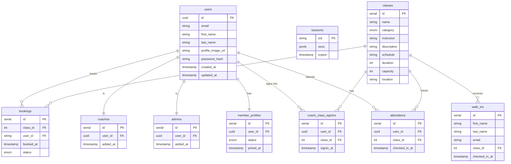

# Border City Boxing — Database Schema

```mermaid
erDiagram
    users {
        uuid id PK
        string email
        string first_name
        string last_name
        string profile_image_url
        string password_hash
        timestamp created_at
        timestamp updated_at
    }

    sessions {
        string sid PK
        jsonb sess
        timestamp expire
    }

    classes {
        serial id PK
        string name
        enum category
        string instructor
        string description
        string schedule
        int duration
        int capacity
        string location
    }

    bookings {
        serial id PK
        int class_id FK
        string user_id FK
        timestamp booked_at
        enum status
    }

    coaches {
        serial id PK
        uuid user_id FK
        timestamp added_at
    }

    coach_class_signins {
        serial id PK
        uuid user_id FK
        int class_id FK
        timestamp signin_at
    }

    admins {
        serial id PK
        uuid user_id FK
        timestamp added_at
    }

    member_profiles {
        serial id PK
        uuid user_id FK
        enum status
        timestamp joined_at
    }

    attendance {
        serial id PK
        uuid user_id FK
        int class_id FK
        timestamp checked_in_at
    }

    walk_ins {
        serial id PK
        string first_name
        string last_name
        string email
        int class_id FK
        timestamp checked_in_at
    }

    users ||--o{ bookings : "books"
    users ||--|| coaches : "is"
    users ||--|| admins : "is"
    users ||--|| member_profiles : "has"
    users ||--o{ coach_class_signins : "signs into"
    users ||--o{ attendance : "attends"

    classes ||--o{ bookings : "has"
    classes ||--o{ coach_class_signins : "has"
    classes ||--o{ attendance : "tracks"
    classes ||--o{ walk_ins : "receives"
```
